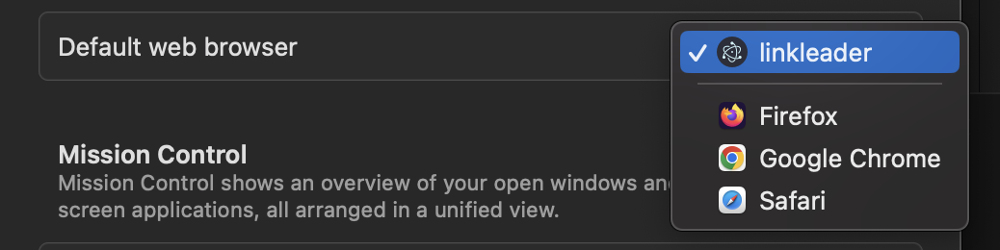

# LinkLeader

## What is it
An app that intercepts opening links in a browser, so you can choose which chrome profile you want to open it in. An extension of that, is the ability to set rules to always open certain links with certain chrome profiles.

There are similar apps on the market, but I wanted to see if I could create it myself. It's quick and dirty, not at all optimised/clean/efficient/production-ready, but it's a POC nonetheless. If you want to know the optimisations I have in mind, feel free to ask!

This was built on MacOS Ventura, exclusively for Chrome.

## How It Works

Chrome Profile details are stored on the machine at `~/Library/Application Support/Google/Chrome`, in the `Local State` file (which seems to be in JSON format despite not having that explicit extension). This lists Chrome profiles under the `profile.info_cache` property, with the object key for each profile being the folder name in the same directory, e.g. 'Default' or 'Profile 1'.

These details are surfaced to the electron app frontend, with click event listeners attached which instructs the electron app backend to run a shell command to open the specified url in chrome with the specified profile.

In addition to this, the profiles are listed in a dropdown within a form in the electron app frontend, which on submit, is used to instruct the electron app backend to create a rule to always open this url with a certain profile, which is handled on the electron app backend before even opening the frontend electron app window. This is achieved by persisting the rules in a `config.json` file located in `~/Library/Application Support/linkleader` and interrogating/updating them as required.

Getting the app to be recognised as a browser was by far the hardest part of this. I'm not entirely sure what exactly allows this, but having played around with the Info.plist values for too long via electron-builder config, I could in future narrow it down until it stops working.

## Notes

Can't use electron forge due to this bug https://github.com/electron/forge/issues/2633, so went with electron builder.
